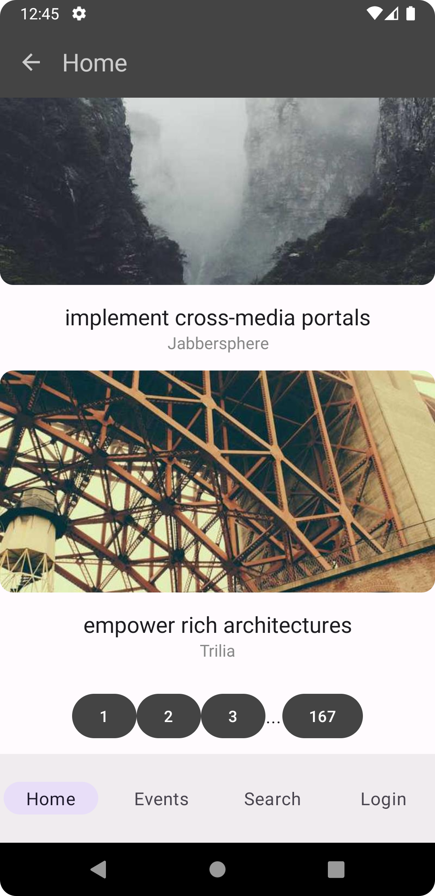

### 21204276

## Event Manager

It is a **work in progress** 🚧.

**Event Manager** is a functional Android app built entirely with Kotlin and Jetpack Compose. It
follows Android design and development best practices and is intended to be a useful practice. As a running app, it's intended to help volunteers search for events, as well as join/unjoin events offered by HKBU.

## Screenshots



## 1. API

**Find all API info, parameters, response here:** https://comp4107-spring2024.azurewebsites.net/#/default/post_api_login_

**Event Manager** displays content from the
[Event Manager](https://comp4107-spring2024.azurewebsites.net/api/events) API offered. API allows you to:

### 1.1. Retrieve Events: `GET` `/api/events/`

- Retrieve Events. The presence of a truthy highlight query parameter will prioritize highlighted events, displaying them first in the results. Additionally, the system supports separate searches for events based on keywords (search) and location. The perPage value will be capped at 30.

### 1.2. Get specific event: `GET` `/api/events/{id}`

- Retrieve an event based on the specified ID provided in the path parameter.

### 1.3. Register logged-in volunteers for events: `POST` `/api/events/{id}/volunteers`

- Enable event registration for logged-in users. The event ID should be provided as the path parameter, allowing users to register for a specific event.

### 1.4. UNregister logged-in volunteers for events: `Delete` `/api/events/{id}/volunteers`

- Enable event unregistration for logged-in users. Users can unregister from a specific event by providing the event ID as the path parameter.

### 1.5. Register as volunteers: `POST` `api/volunteers`

### 1.6. Retrieve volunteer information: `GET` `api/volunteers/{id}/`

- Retrieve volunteer information. Regular volunteers can only access their own information, rendering the ID path parameter irrelevant for them. As a result, a dummy value can be used for the ID parameter when requesting their own information.

### 1.7. Get Volunteer information with their registered events: `GET` `api/volunteers/{id}/events`

- Retrieve volunteer information, including detailed information about their registered events. Regular volunteers can only access their own information, making the ID path parameter unnecessary for them. Hence, when requesting their own information, a dummy value can be used for the ID parameter.

### 1.8. Log in users: `POST` `api/login`

## 2. Sending Requests with KtorClient

To make requests for the above API, I am using KtorClient, a HTTP client library in Kotlin.

### 2.1. Serialization of Inputs and Deserialization of Outputs:

- The code utilizes Kotlin serialization (`kotlinx.serialization`) to serialize and deserialize JSON data. The `@Serializable` annotation is used to mark classes that need to be serialized/deserialized.
- The `Event` class represents the structure of an event, and it is annotated with `@Serializable`. It defines the properties of an event, such as `_id`, `title`, `organiser`, etc.
- The `Response` and `ResponseNew` classes represent the server response containing a list of events. They also use the `@Serializable` annotation to define the structure of the response.

### 2.2. Content Negotiation:

- The `ContentNegotiation` plugin is installed in the Ktor HTTP client to enable content negotiation. It is configured to use JSON as the content type for both requests and responses.
- The `json` function is used to configure the JSON serialization settings, such as ignoring unknown keys since some events may not have volunteers field, for example and being lenient with parsing (not strict).

### 2.3. Error Handling:

- The code includes error handling logic using try-catch blocks to handle exceptions that may occur during HTTP requests. In case of an exception, the code logs the exception and returns a default response or null, depending on the function.

### 2.4. Making HTTP Requests:

- The `KtorClient` object provides several suspend functions to make different types of requests.

* Why use suspend? Enables asynchronous and non-blocking execution, integrates with Kotlin coroutines, allows for sequential and parallel composition of requests, facilitates error handling, and simplifies resource cleanup.

- The `getEvents`, `getEventsLocation`, and `getEventsSearch` functions make GET requests to retrieve events. They include the page number, location, and search query as parameters in the request URL.
- The `getMyEvents` function retrieves events specific to a user by making a GET request with the user's ID.
- The `joinEvent` and `unRegister` functions make POST and DELETE requests, respectively, to join or unregister from an event. They include the event ID and user ID in the request URL.
- The `getEvent` function makes a GET request to retrieve a specific event by its ID.
- The `register` function makes a POST request to register a new user by providing the necessary registration information.
- The `login` function makes a POST request to authenticate a user by providing their email and password.

### 2.5. HTTP Client Configuration:

- The `HttpClient` is initialized with various plugins and default request settings.
- The `Logging` plugin is installed to enable logging of HTTP requests and responses.
- The default request settings include setting the content type and accept headers to `application/json` and including an `Authorization` header with a bearer token (stored in the `token` property) for authenticated requests.

## 3. MainActivity & Navigation with ScaffoldScreen, NavHost, NavController

### 3.1 Main Activity

The `MainActivity` class is the main entry point of an Android application. It extends the `ComponentActivity` class and overrides the `onCreate` method.

In the `onCreate` method, the `super.onCreate(savedInstanceState)` method is called for default initialization.

The content view of the activity is set using the `setContent` function. It includes the `EventManagerTheme` composable, which provides the theme for the application.

Within the `Surface`, the `ScaffoldScreen` composable is called, representing the main screen of the application.

The `ScaffoldScreen` takes a `LoginViewModel` instance as a parameter and handles the UI and logic for the login later.

```
class MainActivity : ComponentActivity() {
    override fun onCreate(savedInstanceState: Bundle?) {
        super.onCreate(savedInstanceState)
        setContent {

            EventManagerTheme {
                // A surface container using the 'background' color from the theme
                Surface(
                    modifier = Modifier.fillMaxSize(),
                    color = MaterialTheme.colorScheme.background
                ) {
                    ScaffoldScreen(LoginViewModel())
                }
            }
        }
    }
}
```

### 3.2 ScaffoldScreen

I have set up basic navigation system using Jetpack Compose's `NavHost` and `NavController`.

1. The `ScaffoldScreen` composable is the entry point for your app's UI. It sets up the overall structure of the screen, including the `Scaffold`, `TopAppBar`, `NavigationBar`, and the content area.

2. Inside the `ScaffoldScreen`, there is a `NavHost` composable that defines the mapping of routes and screens. It uses the `navController` to navigate between the screens.

3. Each screen is defined using the `composable` function inside the `NavHost`. For example, I have screens like "home", "search", "events", "event/{index}/{page}", "oneEvent/{\_id}", "user"/"login" (choose between these based on `loggedIn`), and "registrationPage". These screens correspond to different destinations in the app.

4. Each screen composable receives the necessary data and the `navController` as parameters. It sets up the UI for that specific screen.

5. In the `Scaffold` composable, the `TopAppBar` provides the app bar at the top with a back button and the current screen's title. The title is obtained using the `getScreenTitle` function, which checks the current destination of the `navController` and returns the appropriate title.

6. The `NavigationBar` at the bottom of the screen handles the navigation between the different screens. It uses the `selectedItem` state to keep track of the currently selected item and the `onClick` callback to navigate to the corresponding destination when an item is clicked.

7. Inside each `composable` screen, I set up the UI for that screen using other composable functions like `FeedScreen`, `EventScreen`, `EventPageScreen`, `EventPage`, `MyFeedScreen`, `LoginForm`, and `RegistrationForm`. These composable functions define the specific UI components and logic for each screen.

```
NavHost(
    navController = navController,
    startDestination = "home",
) {
    // mapping of routes and what screens will be shown
    composable("home") {
        selectedItem = 0
        FeedScreen(response, navController, false, 1)
    }
    composable("search") {
        FeedScreen(response, navController, true, 1)
    }

    ....
}
```

## 4. Feed (Home) Screen & Search Screen

`FeedScreen` and `fetchEvent` composable functions are responsible for displaying the feed of events, highlighted are shown first, and individual event items, respectively. Let's take a closer look at how each of these functions works and how they get updated.

### Home Screen

<p float="left">
  
   
</p>

### Search Screen


### 4.1. Params

The `FeedScreen` function is a composable function that takes several parameters: `eventsForPage` (the response containing events for the initial, first page), `navController` (for navigation purposes), `search` (a boolean flag indicating whether the search functionality is enabled), `page` (the current page number).

### 4.2. Remember State

There are several mutable state variables defined using the `remember` function. These variables include `searchQuery` (the current search query), `events` (the list of events to display), `active` (the active state of the search bar), `totalPagesSearchNew` (the total number of pages for search results), and `currentPage` (the current page number).

- Why? By remembering the current page, events, the total number of pages, etc, the app can correctly fetch and display events for the desired page. Without remembering state, the app would have to rely on external sources or recompute the pagination logic every time the UI is recomposed, which could lead to incorrect page navigation and user confusion. For example, when totalPages changes, pagination is recomputed.

### 4.3. Search functionality

If the `search` flag is `true`, the search functionality is enabled. In this case, the `FeedScreen` displays a `SearchBar` component and a `LazyColumn` to show the search results. The `SearchBar` component allows the user to enter a search query and performs a search when the query is submitted. The search results are obtained using the `KtorClient.getEventsSearch` function, which sends a request to the server to fetch the matching events based on the search query and page number, highlighted first. The `events` state variable is updated with the search results, and the `totalPagesSearchNew` variable is updated with the total number of pages for the search results and pagination is recomputed, as well as events that are shown.

### 4.4. Regular Feed

If the `search` flag is `false`, the regular feed is displayed. The `FeedScreen` also uses a `LazyColumn` to show the events. Initially, the `events` state variable is set to the events retrieved from the `eventsForPage` response, which is just the first page. Pagination functionality is also included, allowing the user to navigate through different pages of events. The `totalPagesSearch` variable represents the total number of pages for the feed, and the `currentPage` variable keeps track of the current page. When the user clicks on a page number button, the `events` state variable is updated with the events from the corresponding page using `KtorClient.getEvents` function, highlighted first, as well as which pages we can click onto is updated. First and Last pages always stay.

## 4.5. Individual Events

The `fetchEvent` function is responsible for rendering an individual event item within the feed. It takes an `event` object and the `navController` as parameters. It uses the `Card` composable to create a clickable card representing the event. When the card is clicked, the `navController` navigates to the "oneEvent" destination with the event ID as a parameter. The `AsyncImage` composable is used to display the event image, and the `Box` and `Column` composable are used to position the event title and organizer information below the image.

## 4.6. Coroutines

The code utilizes coroutines to perform asynchronous operations. The `rememberCoroutineScope` function is used to create a coroutine scope that is remembered across recompositions. The `launch` function is used to launch a coroutine and perform the API requests asynchronously for better user experience. The `events` state variable is updated inside the coroutine with the results obtained from the API.

## 5. Registration - Become volunteer


The `RegistrationForm` composable function represents a registration form UI. If users don't have an account, they can create one.

1. `RegistrationData`:
   It is a data class that holds the registration form data, including email, password, name, contact, age group, about, and terms acceptance.

```
data class RegistrationData(
    var email: String = "",
    var password: String = "",
    var name: String = "",
    var contact: String = "",
    var ageGroup: String = "",
    var about: String = "",
    var terms: Boolean = false
) {
    fun isNotEmpty(): Boolean {
        return email.isNotEmpty() && password.isNotEmpty() && name.isNotEmpty() && contact.isNotEmpty() && ageGroup.isNotEmpty() && about.isNotEmpty()
    }
}
```

2. `AgeGroupExposedDropdown`:
   This composable function renders an exposed dropdown menu for selecting the age group. It uses the `ExposedDropdownMenuBox` and `ExposedDropdownMenu` components provided by the Material3 library. The selected age group is passed back to the caller through the `onAgeGroupChange` callback.

```
@OptIn(ExperimentalMaterial3Api::class)
@Composable
fun AgeGroupExposedDropdown(onAgeGroupChange: (String) -> Unit) {
    val context = LocalContext.current
    val ageGroups = arrayOf("15-18", "18-21", "21-30", "30-50", "50+")
    var expanded by remember { mutableStateOf(false) }
    var selectedText by remember { mutableStateOf(ageGroups[0]) }

    Box(
        modifier = Modifier
            .fillMaxWidth()
    ) {
        ExposedDropdownMenuBox(
            expanded = expanded,
            onExpandedChange = {
                expanded = !expanded
            }
        ) {
            TextField(
                value = selectedText,
                onValueChange = {},
                readOnly = true,
                trailingIcon = { ExposedDropdownMenuDefaults.TrailingIcon(expanded = expanded) },
                modifier = Modifier.menuAnchor().fillMaxWidth() // Modified modifier here
            )

            ExposedDropdownMenu(
                expanded = expanded,
                onDismissRequest = { expanded = false },
                modifier = Modifier.fillMaxWidth() // Modified modifier here
            ) {
                ageGroups.forEach { group ->
                    DropdownMenuItem(
                        text = { Text(text = group) },
                        onClick = {
                            selectedText = group
                            expanded = false
                            onAgeGroupChange(group)
                            Toast.makeText(context, group, Toast.LENGTH_SHORT).show()
                        }
                    )
                }
            }
        }
    }
}
```

3. `RegistrationField`:
   This composable function represents a text field for registration form fields like email, password, name, and contact. It uses the `TextField` component provided by the Material3 library. The value of the field is updated through the `onChange` callback.

```
@Composable
fun RegistrationField(
    value: String,
    onChange: (String) -> Unit,
    modifier: Modifier = Modifier,
    label: String = "",
    placeholder: String = ""
) {
    val focusManager = LocalFocusManager.current

    TextField(
        value = value,
        onValueChange = onChange,
        modifier = modifier,
        keyboardOptions = KeyboardOptions(imeAction = ImeAction.Next),
        keyboardActions = KeyboardActions(
            onNext = { focusManager.moveFocus(FocusDirection.Down) }
        ),
        placeholder = { Text(placeholder) },
        label = { Text(label) },
        singleLine = true,
        visualTransformation = VisualTransformation.None
    )
}
```

4. `RegistrationForm`:
   This is the main composable function that renders the registration form UI. It uses a `Column` layout to vertically stack the form fields. Each field is represented by a `RegistrationField` component, with the necessary props passed to it. The age group field utilizes the `AgeGroupExposedDropdown` component.

   The form includes a checkbox for accepting the terms and conditions. The state of the checkbox is stored in the `RegistrationData` object.

5. Data Validation

A `Button` component is used to submit the registration form. On clicking the button, the form data is validated using the `checkRegData` function. If the data is valid, a network request is made to register the user using the `KtorClient.register` function. The result is displayed using a `Snackbar` from the Material3 library.

6. Redirect the user to the login page

If successful, user is redirected to the login page.

```
coroutineScope.launch {
    val stringBody: String? =
        KtorClient.register(registrationData.email, registrationData.password, registrationData.name, registrationData.contact, registrationData.ageGroup, registrationData.about, registrationData.terms)

    if (stringBody!= null) {
        snackbarHostState.showSnackbar("Succefully created new account: " + stringBody + "\nLogin with your new account.")
        navController.navigate("login")
    } else {
        snackbarHostState.showSnackbar("Error while creating new account.")
    }
}
```

## 6. Login Form


This is Login Screen, where users will usually navigate after the `Home` or `Become Volunteer` Screen.

1. Login Form:
   The login form is composed of two input fields: `LoginField` and `PasswordField`. The `LoginField` component handles the user's login input, while the `PasswordField` component handles the password input. Both components utilize the `TextField` composable from Jetpack Compose to capture and display the user's input.

2. LoginForm Composable & Data Validation:
   The `LoginForm` composable is the main UI component responsible for rendering the login form. It receives a `NavController` for navigation, a `SnackbarHostState` for displaying snackbar messages, and a `LoginViewModel` for managing the login state.

   Inside the `LoginForm` composable, the user's input is stored in a `credentials` variable using the `mutableStateOf` function. Button can only be clicked if credentials isn't empty: `enabled = credentials.isNotEmpty(),`. When the login button is clicked, a coroutine is launched to perform the login logic...

3. LoginViewModel & UserPrefernces:

The `LoginForm` composable interacts with the `LoginViewModel` and `UserPreferences` classes as follows:

- After a successful login, the token is ussed, which is saved in th `httpClient` using the suspend `login` function.
- `LoginForm` calls `loginViewModel.logIn()` to update the login state.
- The token obtained from the login response is decoded and `userID` is saved using `dataStore.saveUserId(userId)`.
- The `loggedIn` state in `LoginViewModel` is used to determine whether the user is logged in or not, which can be checked in the scaffold screen to display the appropriate content.
- The `getUserId` property in `UserPreferences` provides a `Flow` of the user ID, allowing other parts of the application to observe changes to the user ID and make requests using it.

## 7. Location Page


This tab is responsible for displaying a list of single-digit numbers, and when you click on each number, it navigates to a page showing events with a location that starts with that single-digit number.

1. Scrollable Column:
   The main UI component is a `Column` that is scrollable vertically with the help of `rememberScrollState()` that remembers the `scrollState`. It allows the user to scroll through the list of numbers and events.

2. List of Numbers:
   The `repeat` function is used to iterate from 0 to 8 (9 iterations in total). For each iteration, a `ListItem` is created. The `headlineContent` of each `ListItem` is set to display the number, which is `index + 1`. For example, the first item displays "1," the second item displays "2," and so on.

3. Clickable Behavior:
   Clicking on a number will take users to another page that displays events with a location starting with that single-digit number. The navigation is handled by the `navController.navigate` function.

```
ListItem(
    headlineContent = { Text("${index+1}") },
    // go to event page
    modifier = Modifier.clickable {
        navController.navigate("event/${index + 1}/${page}")
    },
)
```

4. Redirect to page with Specific Location:

I extract "index" and "page" route parameters from the current navigation state. If both values are not null, it fetches the events for the specified location using an asynchronous call. The result is stored in a variable called eventsForLocRes, which holds a response object containing the events. Finally, the EventPageScreen composable is invoked with the necessary parameters to display the events.

```
 composable("event/{index}/{page}") { backStackEntry ->
    val location : String? = backStackEntry.arguments?.getString("index")
    val page : Int? = backStackEntry.arguments?.getString("page")?.toIntOrNull()
    backStackEntry.arguments?.toString()?.let { Log.i("index", it) }
    if (location != null && page !=null) {
        var eventsForLocRes by remember { mutableStateOf(Response(listOf<Event>(), null, null, null)) }
        LaunchedEffect(location) {
            eventsForLocRes = KtorClient.getEventsLocation(page, location)
        }
        EventPageScreen(eventsForLocRes, navController, location.toString(), page)
    } else {
        // Handle the case where index is null
        EventPageScreen( Response(listOf<Event>(), null, null, null), navController, location.toString(), page)
    }
}
```

## 8. Events Page Screen


1. The `EventPageScreen` composable function renders a page that shows events for a specific location. It takes parameters such as `eventsLocRes` (containing the events, which we get with the code above), `navController` (for navigation), `location` (the specific location), and `page` (the current page number).

2. The function uses a `LazyColumn` to display the events in a scrollable list. Each event is rendered as a `ListItem` showing the title and location.

```
items(eventsLocRes.events) { event ->
    ListItem(
        headlineContent = { Text(event.title) },
        supportingContent = { Text(event.location) },
        modifier = Modifier.clickable {
            navController.navigate("oneEvent/${event._id}")
        },
    )
    Divider()
}
```

3. Clicking on an event navigates to a page displaying detailed information about that event which we get from `KtorClient.getEvent(eventId)`. We also pass if user is logged in and registered to this event.

- From `ScaffolScreen`:

```
composable("oneEvent/{_id}") { backStackEntry ->
    val eventId = backStackEntry.arguments?.getString("_id")
    if (eventId != null) {

        var event by remember { mutableStateOf<Event?>(null) }
        LaunchedEffect(eventId) {
            event = KtorClient.getEvent(eventId)
        }

        var registered by remember { mutableStateOf<Boolean>(false) }
        LaunchedEffect(eventId) {
            registered =
                KtorClient.getEvent(eventId)?.volunteers?.contains(userId) ?: false
        }

        event?.let { EventPage(event!!, snackbarHostState, loggedIn, registered) }
    } else {
        // Handle the case where eventId is null
        Log.i("Event id is null" ," NULL");

    }
}
```

## 9. Event Page - Single Event

### If loggedIn:

- Join Event
  
  

-UnJoin Event


### If not logged in:


The `EventPage` composable function renders a page that displays detailed information about a single event. It provides options for user registration or unregistration based on the user's logged-in status and registration status for the event (get these from params)

1. User Data:
   The function retrieves user data from a `UserPreferences` data store, including the user ID. This data is collected as a state using `collectAsState`.

2. UI Structure:
   The UI is structured using a `LazyColumn` to allow vertical scrolling. The event's image is displayed within a `Card`, followed by a `Box` containing various details about the event, such as the title, organizer, description, date, location, and quota. Each detail is displayed using a `Text` composable.

3. Registration Buttons:
   Depending on the user's logged-in status and registration status for the event, different buttons are displayed.

   - If the user is logged in and not registered for the event, a "Join Event" button is shown. Clicking on this button triggers a coroutine that calls `KtorClient.joinEvent` to register the user for the event. The result is shown as a snackbar using `snackbarHostState.showSnackbar`. If quota is available, we can register the user. Otherwise, no.

   - If the user is logged in and already registered for the event, an "Unregister" button is displayed. Clicking on this button triggers a coroutine that calls `KtorClient.unRegister` to unregister the user from the event. The result is shown as a snackbar.

4. Snackbar:
   The `snackbarHostState` is used to show snackbar messages for registration or unregistration results, as well as any errors.

## 10. User Page - Show Registered Event

- User can navigate to "User" Page to see registered Events. I could have reused `FeedScreen`, but API for getting events for specific user does not have `perPage`, so we will just show all the events on one screen.


1. Get Registered Events using API

```
composable("user") {
    if (userId != null) {

        var eventsForPage by remember { mutableStateOf(listOf<Event>()) }
        LaunchedEffect(userId) {
            eventsForPage = KtorClient.getMyEvents(userId!!)?.events ?: emptyList<Event>()
        }
        MyFeedScreen(eventsForPage, navController)
    } else {
        // Handle the case where eventId is null
        Log.i("Event id is null" ," NULL");
        MyFeedScreen(listOf<Event>(), navController)

    }
}
```

2. `MyFeedScreen` is just like `FeedScreen`, but no pagination, a composable function that renders a screen displaying a list of events in a feed-like format. It uses a `LazyColumn` for vertical scrolling and iterates over the provided `eventsForPage` list. Each event is displayed as a `Card` with a clickable behavior that navigates to the event's page. The card contains an image, title, and organizer information. A divider separates each event in the list.

## Assumptions

1. No Pagination needed for Registered Events.
2. Age Groups:

> val ageGroups = arrayOf("15-18", "18-21", "21-30", "30-50", "50+")

3. Quota, date for event registration is not checked. Assumed to be checked by the backed.

4. If I go to Location Page, Press "1", go to "Users", then come back to "Location", I will see events for "1", not the starter location page,
